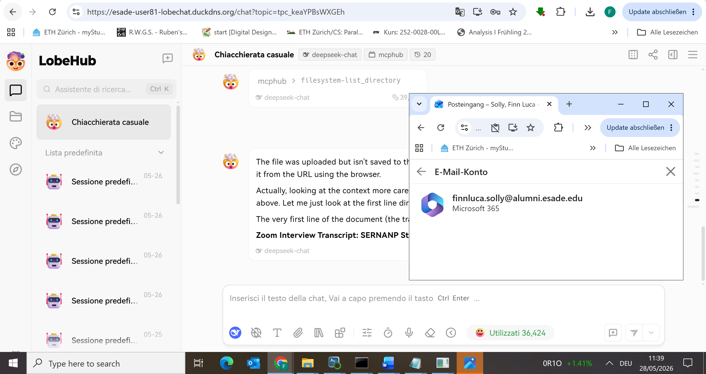
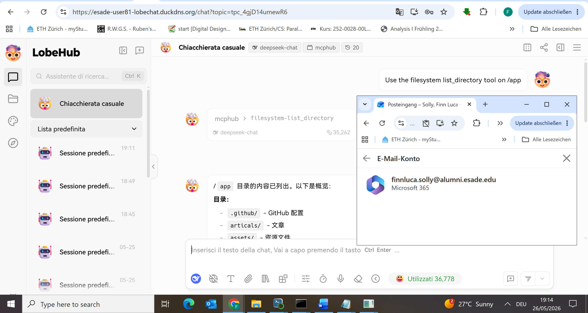

# Final Project — Evidence Report

## 1. Identity

| Field | Value |
|---|---|
| Student name | Finn Luca Solly |
| ESADE email | finnluca.solly@alumni.esade.edu |
| GitHub repo URL | https://github.com/FinnSolly2/lobechat-aws (private; user `joseporiolrius` invited as collaborator) |
| Latest commit SHA | TODO — run `git rev-parse HEAD` after final commit |
| Final tag | TODO — run `cz bump` then `git tag` |

## 2. Public URL

**[https://esade-user81-lobechat.duckdns.org](https://esade-user81-lobechat.duckdns.org)**

## 3. Screenshot — LobeChat over HTTPS, logged in



*Timestamp: 11:39, 28/05/2026 — HTTPS URL visible in address bar, ESADE email `finnluca.solly@alumni.esade.edu` visible in browser profile, LobeChat loaded with active MCP tool call (`mcphub > filesystem-list_directory`)*

## 4. Screenshot — chat working (streaming + MCP)



*Timestamp: 19:14, 26/05/2026 — `mcphub > filesystem-list_directory` tool call executed and returned real `/app` directory contents from the MCPHub container*

## 5. Public reachability — `curl -sI https://esade-user81-lobechat.duckdns.org/`

```
$ curl -sI https://esade-user81-lobechat.duckdns.org/
HTTP/2 307
alt-svc: h3=":443"; ma=2592000
date: Tue, 26 May 2026 17:36:37 GMT
location: /chat
via: 1.1 Caddy
```

*Run from `C:\Users\Lenovo` (laptop, external to EC2). HTTP/2 confirmed, TLS negotiated without error, Caddy reverse proxy responding, 307 redirect to `/chat` is expected LobeChat behaviour.*

## 6. Negative test — port 47000 closed

```
$ curl -v --max-time 5 http://99.80.28.8:47000/
*   Trying 99.80.28.8:47000...
* Connection timed out after 5002 milliseconds
* Closing connection
curl: (28) Connection timed out after 5002 milliseconds
```

*Run from `C:\Users\Lenovo` (laptop, external to EC2). Port 47000 is not open in the EC2 security group. LobeChat is only reachable via Caddy on port 443.*

## 7. Stack runtime — `docker compose ps`

```
$ docker compose -f docker-compose.yml -f docker-compose.override.yml ps
WARN[0000] The "HF_TOKEN" variable is not set. Defaulting to a blank string.
WARN[0000] The "SSH_HOST" variable is not set. Defaulting to a blank string.
WARN[0000] The "SSH_USERNAME" variable is not set. Defaulting to a blank string.
WARN[0000] The "SSH_ALLOWED_COMMANDS" variable is not set. Defaulting to a blank string.
WARN[0000] The "SSH_ALLOWED_PATHS" variable is not set. Defaulting to a blank string.
WARN[0000] The "SSH_COMMANDS_BLACKLIST" variable is not set. Defaulting to a blank string.
WARN[0000] The "SSH_ARGUMENTS_BLACKLIST" variable is not set. Defaulting to a blank string.
NAME              IMAGE                        COMMAND                  SERVICE     CREATED        STATUS                  PORTS
casdoor           casbin/casdoor:v2.13.0       "/server /bin/sh -c …"   casdoor     26 hours ago   Up 26 hours             0.0.0.0:47002->8000/tcp, [::]:47002->8000/tcp
lobe-chat         lobehub/lobe-chat-database   "/bin/node /app/star…"   lobe-chat   26 hours ago   Up 26 hours             0.0.0.0:47000->3210/tcp, [::]:47000->3210/tcp
mcphub            samanhappy/mcphub:latest     "/usr/local/bin/entr…"   mcphub      26 hours ago   Up 26 hours             0.0.0.0:47008->3000/tcp, [::]:47008->3000/tcp
minio             minio/minio:latest           "/usr/bin/docker-ent…"   minio       26 hours ago   Up 26 hours (healthy)   0.0.0.0:47005->9000/tcp, [::]:47005->9000/tcp, 0.0.0.0:47006->9001/tcp, [::]:47006->9001/tcp
shared-postgres   pgvector/pgvector:pg16       "docker-entrypoint.s…"   postgres    26 hours ago   Up 26 hours (healthy)   0.0.0.0:47003->5432/tcp, [::]:47003->5432/tcp
vllm              python:3.11-slim             "python -c 'import j…"   vllm        26 hours ago   Up 26 hours (healthy)   0.0.0.0:47007->8000/tcp, [::]:47007->8000/tcp
```

*Run on EC2 (`ubuntu@ip-172-31-36-25`). All 6 services are Up. `minio`, `postgres`, and `vllm` (mock) report healthy. `lobe-chat`, `casdoor`, and `mcphub` do not define a Docker healthcheck in the compose file but are confirmed working via the browser screenshots above. Qdrant is not part of the single-EC2 deployment; its architecture role is addressed in Q2.*
