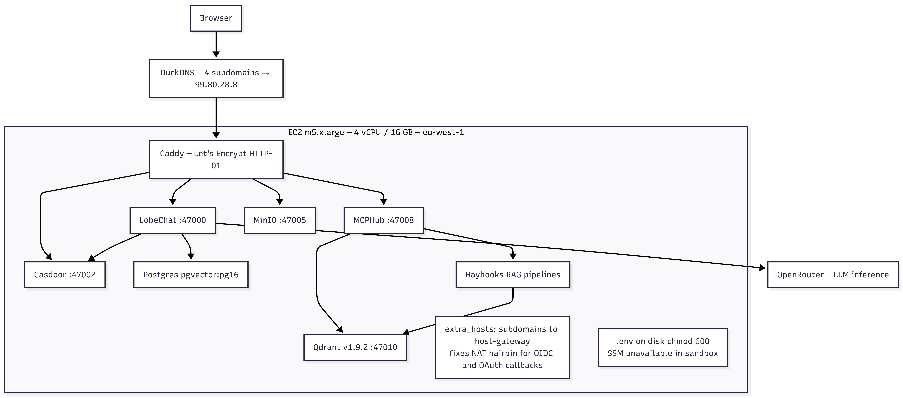
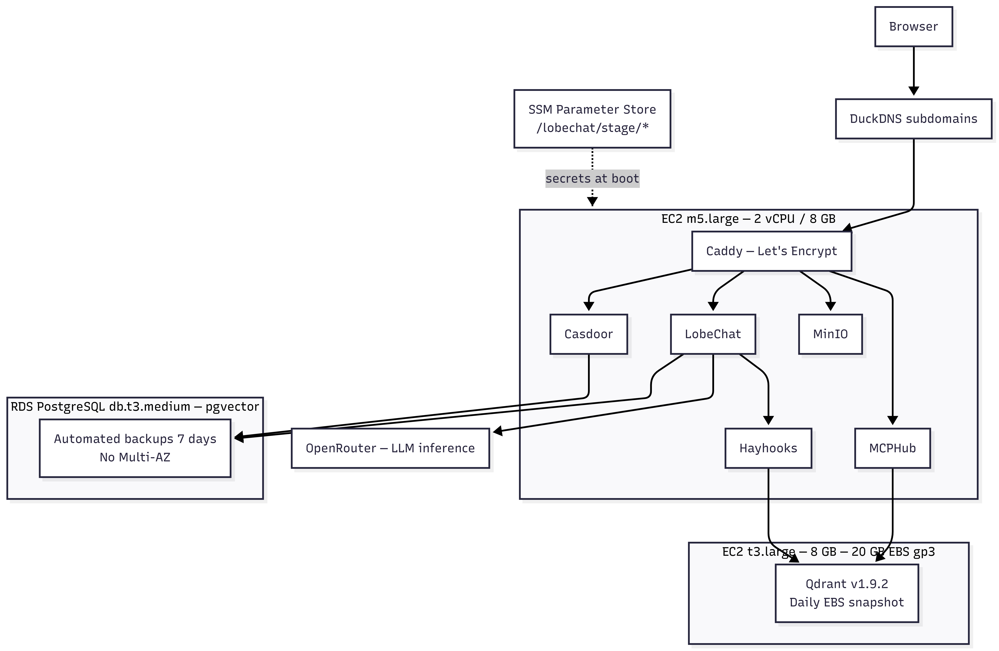
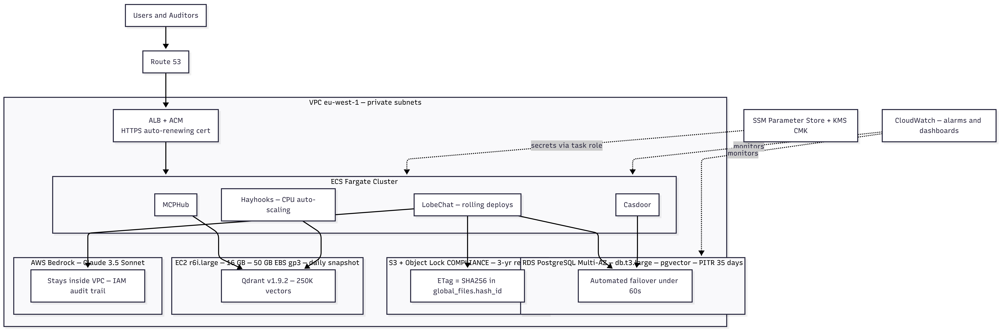

# Q2 - 3-environment architecture evolution

## Overview

The initial deployment of the compliance audit platform from Q1 consists of only `docker compose up` on a single EC2. While that works fine for a single developer experimenting with the software, it will obviously not work for a firm of 200 employees working against a deadline to provide evidence packages to third-party auditors. Data-at-rest services (Postgres, MinIO, Qdrant) are where failures are hardest to recover from, so those move to managed services in prod.

---

## Per-environment component table

| Component | Dev | Stage | Prod | Key change |
|---|---|---|---|---|
| **LobeChat** | m5.xlarge, all-in-one compose | m5.large, same compose | ECS Fargate + ALB | Rolling deploys; no single host failure |
| **Casdoor** | Same EC2, container | Same EC2, container | ECS Fargate (backed by RDS) | Cognito migration cost too high; keep OIDC config in git |
| **Postgres** | pgvector:pg16 container | RDS db.t3.medium | RDS db.t3.large Multi-AZ | Stage uses RDS intentionally, catches parameter group and pgvector version surprises before prod |
| **MinIO** | Container, `./data/minio` | Container or S3 | S3 + Object Lock (COMPLIANCE) | Tamper-evidence for SOC 2 requires Object Lock; MinIO is S3-compatible by design |
| **Qdrant** | Same EC2, `./data/qdrant` | Separate t3.large, 20 GB EBS | Separate r6i.large, 50 GB EBS | Hard constraint: EC2 in all envs; instance family changes per scale |
| **MCPHub** | Same EC2, container | Same EC2, container | ECS Fargate | No AWS-native MCP routing equivalent |
| **Hayhooks** | Same EC2, container | Same EC2, container | ECS Fargate, CPU auto-scaling | Stateless; scales horizontally on RAG volume spikes |
| **LLM backend** | OpenRouter | OpenRouter | AWS Bedrock (Claude 3.5 Sonnet) | Audit evidence cannot transit a third-party inference layer; Bedrock stays inside VPC |
| **Secrets** | `.env` on disk, chmod 600 | SSM Parameter Store | SSM Parameter Store + KMS CMK | Sandbox lacked SSM write permissions; prod requires no secrets in operator shell |
| **TLS / proxy** | Caddy + DuckDNS (4 subdomains) | Caddy + DuckDNS | ALB + ACM + Route 53 | ACM auto-renews; ALB handles SSE buffering natively |

---

## Qdrant on EC2 - sizing, snapshots, recovery

**But why not pgvector?** It is already present in the stack. The rationale behind keeping Qdrant separate: each RAG request carries a per-user filter. Qdrant's filtered ANN applies the filter *during* HNSW traversal. pgvector applies `WHERE user_id = $1` *after* retrieving the global top-k, meaning at 100 users it scans the full index and keeps only ~1% of results. At 1000 users that breaks query performance.

**EBS sizing.** The embedding model produces 1536-dim float32 vectors, ~19 KB per chunk including HNSW overhead. At 250 chunks per user with 3× headroom for WAL and compaction working space:

| Scale | Vectors | With 3× headroom | EBS |
|---|---|---|---|
| 10 users (dev) | 2,500 | ~150 MB | 10 GB |
| 100 users (stage) | 25,000 | ~1.5 GB | 20 GB |
| 1,000 users (prod) | 250,000 | ~15 GB | 50 GB |

When a user uploads a 50-page SOC 2 report via Hayhooks, Qdrant indexes more than 200 chunks at once; bulk indexing briefly doubles on-disk footprint before compaction resolves.

**Instance sizing.** 1,000 users require ~3 GB RAM steady-state, ~5.5 GB when compacting. Dev deploys Qdrant on the shared m5.xlarge where total stack RSS is ~2.1 GB, leaving ~14 GB headroom: co-locating Qdrant costs ~75 MB, which is trivial. Stage deploys Qdrant on a dedicated t3.large to catch OOM and burst credit exhaustion before going live. Prod uses a dedicated r6i.large (memory-optimized family, 16 GB). Co-locating Qdrant on the prod m5.xlarge would create CPU contention with Playwright headless Chromium and Postgres concurrent connections.

**Snapshots.** Daily EBS snapshots, retained 30 days. Hourly is excessive because Qdrant is a derived index, with source documents live on S3, so if vectors go missing we rebuild from source. Expected recovery time from EC2 termination: ~21 minutes.

---

## AWS managed services in prod

Prod requires eight services: ALB, ACM, RDS PostgreSQL, S3, Bedrock, SSM Parameter Store, CloudWatch, and Route 53. This satisfies the ≥4 constraint on managed services, each of which is necessary for the compliance use case:

- **ALB + ACM + Route 53**: SSL/TLS termination with auto-renewal, and DNS failover. This avoids the need for the `flush_interval -1` workaround using Caddy in dev/stage to avoid SSE buffering.
- **RDS PostgreSQL Multi-AZ**: automated Point-in-Time Recovery at 5-minute intervals and automatic failover in under 60 seconds. PostgreSQL is referenced in the `global_files.url` field in conjunction with S3. It is the most difficult store to restore manually, hence the managed backup is mandatory.
- **S3 + Object Lock (COMPLIANCE mode)**: Nobody: root user, AWS support, anyon, is able to modify an object after locking until the expiry date. When paired with SHA256 ETags kept in the `global_files.hash_id` attribute, this fulfills the requirement for tamper-evidence that SOC 2 demands.
- **AWS Bedrock**: Inference service works inside VPC and has fully audited IAM permissions for accessing the service. OpenRouter can be used in dev/stage; it cannot be used in prod due to lack of audit evidence across the third-party inference layer.
- **SSM Parameter Store + KMS CMK**: Secrets are retrieved from SSM at startup using instance/task role: secret never touches operator's terminal/Shell environment.
- **CloudWatch**: Monitoring of container metrics, RDS alarms, Qdrant EC2 memory usage warnings.

---

## Promotion flow

**Branching strategy:** `feature/* → stage → main`. No develop branch is needed because for two to three developers it's an overhead. `stage` is the integration branch, `main` is guarded and requires one review.

**The patch compatibility gate.** There is one place where we need to guard against deploy failures: `patches/route.js` is a 3.3 MB webpack bundle mounted into the LobeChat container providing the session retry functionality of MCP. When the image was upgraded from Next.js 15.3.6 to 15.3.8, webpack changed all module IDs. This patch used module ID `89024.js`, which disappeared. Out of the 29 modules referenced only 1 was there: `MODULE_NOT_FOUND`. The tool calls failed in LobeChat with `response.undefined`. The model was working, but generating fake results. MCPHub did not receive anything. Failure was completely invisible on the HTTP level since the router was returning 200.

The patch compatibility test will extract `route.js` from the new image and check that all module IDs used in the patch are available in the canonical file.

The second gate focuses on the vulnerability with `init_data.json`. The current bootstrap script dynamically patches Casdoor's seed file at run-time using `jq`. However, the process is inconsistent because the idempotence condition detects nothing on the production node after the stage node operation, since the `jq` command updates placeholder URLs with stage URLs and vice versa: auth breaks silently from first boot. The fix is an `envsubst` template: `init_data.json.tpl` in git with `${LOBECHAT_REDIRECT_URI}` and `${CASDOOR_ORIGIN}` placeholders; the generated file is gitignored.

**Stage → prod gate.** Besides module ID verification, the smoke test also confirms an increase in the count of requests to MCPHub post tool invocation. The presence of HTTP 200 response at the tRPC endpoint does not mean everything is okay; this is precisely the problem. What is observable in relation to MCPHub is what matters. One reviewer confirms the smoke test passed on the stage instance before merging to main.

---

## Data strategy

### Dev.
Postgres rebuilt from `db/schema.sql` only, no prod copy restoration. One potential gotcha: `ai_providers.key_vaults` holds provider credentials encrypted with AES and keyed by `KEY_VAULTS_SECRET`. Should the prod database be dumped back onto dev, but with a different `KEY_VAULTS_SECRET`, all credentials will silently become invalid, which will appear as a provider config failure, not a key mismatch. Dev should use its own `KEY_VAULTS_SECRET`. Anonymization for MinIO sources occurs prior to indexing: internal IPs are scrubbed with an RFC 5737 documentation address (`192.0.2.x`), instance IDs replaced with format-preserving tokens (`i-00000000000000001`), and usernames in auth logs redacted. Embedding model embeds context (e.g., brute force attempt from internal host), not IP, thus the vector produced by anonymization remains semantically equivalent to the source.

### Stage.
Postgres deployed to RDS in order to catch any parameter group or pgvector version discrepancies prior to prod deployment. Consistency with prod is verified through comparing the latest `drizzle.__drizzle_migrations` hash in stage vs prod before prod deployment. Qdrant seeded with 50 fake documents, stage verifies that the pipeline works, not vectors equality to those in prod. Compliance artifacts are excluded from staging environment, SSH access is wider and logging more verbose here. `mcp_settings.json` derived from stage SSM parameters; MCPHub bearer token never copied from prod.

### Prod.
S3 configured with Object Lock (COMPLIANCE mode with a three-year retention period) along with SHA256 hash stored in `global_files.hash_id` field (S3 ETag) guarantees the chain of custody from Q1: document X has been uploaded with hash Y and cannot have been modified since. Postgres and S3 referentially coupled via `global_files.url`: backups include both together. Daily `pg_dumpall` backups to S3 with SSE-KMS encryption, kept for 30 days. `mcp_settings.json` is a non-event to lose after migration to SSM parameter storage, which takes less than 30 seconds to generate upon boot.

---

## Trade-off table

| Dimension | Dev | Stage | Prod |
|---|---|---|---|
| **Reliability** | 1/5: single EC2; instance loss = full outage | 3/5: RDS for Postgres; dedicated Qdrant instance | 5/5: Fargate, RDS Multi-AZ, ALB health checks, S3 eleven-nines |
| **Cost** | 1/5 (~$150/mo) | 3/5 (~$350/mo) | 5/5 (~$800–1,200/mo at 100 MAU, before token costs) |
| **Ops complexity** | 1/5: `docker compose up`, one machine | 3/5: two EC2s, RDS, SSM, CI gates | 4/5: Fargate, ALB, RDS Multi-AZ, S3 Object Lock, CloudWatch, backup schedules |

The non-obvious point: stage costs ~40% of prod to run correctly. A stage on a t3.medium running `docker compose` is cheap but meaningless, it won't catch RDS parameter group issues, Qdrant OOM, or ALB timeout behavior. Most teams underspend on stage and pay for it in prod incidents.

---

## Reverse-proxy / TLS choice

**Dev and stage: Caddy + DuckDNS.** Caddy handles Let's Encrypt HTTP-01 certificate issuance automatically, zero config beyond the Caddyfile site block. DuckDNS gives each environment its own subdomain with its own Let's Encrypt rate-limit budget, avoiding the shared-limit risk of `sslip.io` or `traefik.me` on demo day. Four subdomains (lobechat, casdoor, mcphub, s3) all point to the same Elastic IP. One non-obvious requirement discovered during deployment: `flush_interval -1` must be set on every reverse proxy block, otherwise Caddy buffers SSE responses and LLM tokens arrive all at once instead of streaming. The Casdoor subdomain is also necessary, Casdoor cannot be served under a subpath because its React SPA has `homepage: "/"` baked in at build time, so `/casdoor/*` routing is a dead end.

**Prod: ALB + ACM + Route 53.** ALB terminates TLS with an ACM certificate that auto-renews without any cron job or certbot. Route 53 handles DNS failover. ALB natively handles long-lived SSE connections and WebSocket upgrades without any `flush_interval` workaround. The cost difference (ALB ~$20/mo vs Caddy free) is justified by the elimination of certificate renewal toil and the operational maturity expected in a SOC 2 environment.

---

## Architecture diagrams

