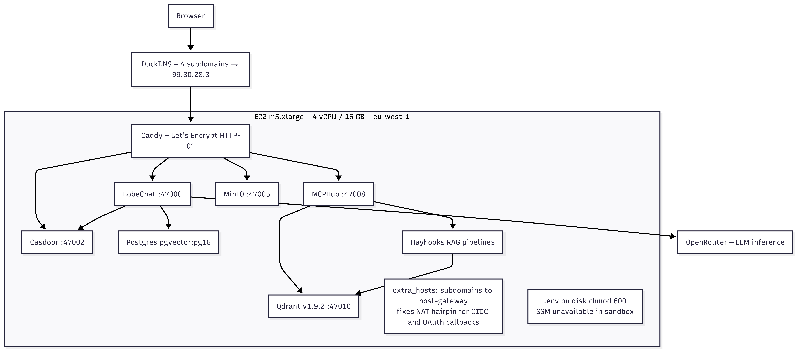
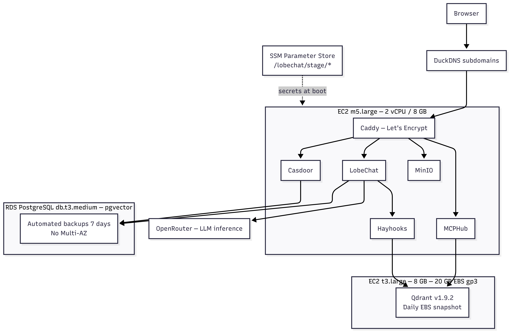
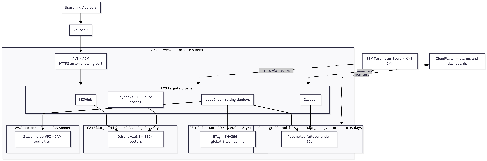

# Q2 - 3-environment architecture evolution

## Overview

The compliance audit platform from Q1 starts as `docker compose up` on a single EC2, which is fine for a developer, but not for a 200-person firm delivering SOC 2 evidence on a deadline. Data-at-rest services (Postgres, MinIO, Qdrant) are where failures are hardest to recover from, so those move to managed services in prod.

---

## Per-environment component table

| Component | Dev | Stage | Prod | Key change |
|---|---|---|---|---|
| **LobeChat** | m5.xlarge, all-in-one compose | m5.large, same compose | ECS Fargate + ALB | Rolling deploys; no single host failure |
| **Casdoor** | Same EC2, container | Same EC2, container | ECS Fargate (backed by RDS) | Cognito migration cost too high; keep OIDC config in git |
| **Postgres** | pgvector:pg16 container | RDS db.t3.medium | RDS db.t3.large Multi-AZ | Stage uses RDS intentionally, catches parameter group and pgvector version surprises before prod |
| **MinIO** | Container, `./data/minio` | Container or S3 | S3 + Object Lock (COMPLIANCE) | Tamper-evidence for SOC 2 requires Object Lock; MinIO is S3-compatible by design |
| **Qdrant** | Same EC2, `./data/qdrant` | Separate t3.large, 20 GB EBS | Separate r6i.large, 50 GB EBS | Hard constraint: EC2 in all envs; instance family changes per scale |
| **MCPHub** | Same EC2, container | Same EC2, container | ECS Fargate | No AWS-native MCP routing equivalent |
| **Hayhooks** | Same EC2, container | Same EC2, container | ECS Fargate, CPU auto-scaling | Stateless; scales horizontally on RAG volume spikes |
| **LLM backend** | OpenRouter | OpenRouter | AWS Bedrock (Claude 3.5 Sonnet) | Audit evidence cannot transit a third-party inference layer; Bedrock stays inside VPC |
| **Secrets** | `.env` on disk, chmod 600 | SSM Parameter Store | SSM Parameter Store + KMS CMK | Sandbox lacked SSM write permissions; prod requires no secrets in operator shell |
| **TLS / proxy** | Caddy + DuckDNS (4 subdomains) | Caddy + DuckDNS | ALB + ACM + Route 53 | ACM auto-renews; ALB handles SSE buffering natively |

---

## Qdrant on EC2: sizing, snapshots, recovery

**But why not pgvector?** It is already present in the stack. The rationale behind keeping Qdrant separate: each RAG request carries a per-user filter. Qdrant's filtered ANN applies the filter *during* HNSW traversal. pgvector applies `WHERE user_id = $1` *after* retrieving the global top-k, meaning at 100 users it scans the full index and keeps only ~1% of results. At 1000 users that breaks query performance.

**EBS sizing.** The embedding model produces 1536-dim float32 vectors, ~19 KB per chunk including HNSW overhead. At 250 chunks per user with 3× headroom for WAL and compaction working space:

| Scale | Vectors | With 3× headroom | EBS |
|---|---|---|---|
| 10 users (dev) | 2,500 | ~150 MB | 10 GB |
| 100 users (stage) | 25,000 | ~1.5 GB | 20 GB |
| 1,000 users (prod) | 250,000 | ~15 GB | 50 GB |

When a user uploads a 50-page SOC 2 report via Hayhooks, Qdrant indexes more than 200 chunks at once; bulk indexing briefly doubles on-disk footprint before compaction resolves.

**Instance sizing.** 1,000 users require ~3 GB RAM steady-state, ~5.5 GB when compacting. Dev co-locates Qdrant on the shared m5.xlarge, so the total stack RSS is ~2.1 GB, Qdrant adds ~75 MB, trivial on a 16 GB machine. Stage uses a dedicated t3.large to catch OOM and burst credit exhaustion before prod. Prod uses a dedicated r6i.large (memory-optimized, 16 GB),as co-locating on the main m5.xlarge would cause CPU contention between Qdrant compaction, Playwright headless Chromium, and Postgres concurrent connections.

**Snapshots.** Daily EBS snapshots, retained 30 days. Hourly is excessive because Qdrant is a derived index, source documents live on S3, so if vectors go missing we rebuild from source. Expected recovery time from EC2 termination: ~21 minutes.

---

## AWS managed services in prod

Prod uses eight managed services: ALB, ACM, RDS PostgreSQL, S3, Bedrock, SSM Parameter Store, CloudWatch, Route 53, so it satisfys the ≥4 constraint. Each is load-bearing for the compliance use case: ALB + ACM handles TLS auto-renewal and SSE without the `flush_interval -1` workaround; RDS Multi-AZ gives 5-minute PITR and sub-60s failover for the store most coupled to S3; S3 Object Lock (COMPLIANCE mode) with SHA256 ETags in `global_files.hash_id` provides tamper-evident chain of custody; Bedrock keeps inference inside the VPC with full IAM audit trail; SSM means secrets never touch an operator terminal; CloudWatch covers container metrics, RDS alarms, and Qdrant memory alerts.

---

## Promotion flow

**Branching strategy:** `feature/* → stage → main`. No develop branch as for two or three people this would just be overhead. `stage` is the integration branch; `main` is protected and requires one review.

**The patch compatibility gate.** One fragility needs to be explicitly gated: `patches/route.js` is a 3.3 MB webpack bundle mounted into LobeChat for MCP session retry. When the image upgraded from Next.js 15.3.6 to 15.3.8, webpack renumbered all module IDs. The patch referenced `chunk 89024.js` which no longer existed, 28 of 29 modules disappeared, tRPC tools requests failed with `MODULE_NOT_FOUND`, and LobeChat showed `response.undefined` while MCPHub received nothing. The route returned 200 the whole time, therefore the failure was invisible at HTTP level.

The patch compatibility test will extract `route.js` from the new image and check that all module IDs used in the patch are available in the canonical file.

The second gate focuses on the vulnerability with `init_data.json`. The current bootstrap script dynamically patches Casdoor's seed file at run-time using `jq`. However, the process is inconsistent because the idempotence condition detects nothing on the production node after the stage node operation, since the `jq` command updates placeholder URLs with stage URLs and vice versa: auth breaks silently from first boot. The fix is an `envsubst` template: `init_data.json.tpl` in git with `${LOBECHAT_REDIRECT_URI}` and `${CASDOOR_ORIGIN}` placeholders; the generated file is gitignored.

**Stage → prod gate.** Beyond module ID verification, the smoke test confirms MCPHub's request count increases after a tool call. HTTP 200 from the tRPC endpoint is not sufficient, because that was the exact failure mode. One reviewer confirms the smoke test passed on the stage instance before merging to main.

---

## Data strategy

### Dev.
Postgres rebuilt from `db/schema.sql` only, no prod copy. Key pitfall: `ai_providers.key_vaults` holds AES-encrypted provider credentials keyed by `KEY_VAULTS_SECRET`. Restoring a prod dump to dev with a different secret makes all credentials silently invalidd, manifests as a provider config error, not a key mismatch. Dev must use its own `KEY_VAULTS_SECRET`. MinIO sources anonymized before indexing: internal IPs replaced with RFC 5737 addresses (`192.0.2.x`), instance IDs with format-preserving tokens (`i-00000000000000001`), usernames redacted. The embedding model embeds context, not raw IPs, so anonymized docs produce semantically equivalent vectors.

### Stage.
Postgres on RDS to catch parameter group and pgvector version issues before prod. Schema consistency verified by comparing the latest `drizzle.__drizzle_migrations` hash between stage and prod before any prod deployment. Qdrant seeded with 50 synthetic documents, stage verifies the pipeline works, not vector equality with prod. Compliance artifacts excluded from stage, as SSH access is broader and logs more verbose. `mcp_settings.json` generated from stage SSM parameters; MCPHub bearer token never copied from prod.

### Prod.
S3 configured with Object Lock (COMPLIANCE mode with a three-year retention period) along with SHA256 hash stored in `global_files.hash_id` field (S3 ETag) guarantees the chain of custody from Q1: document X has been uploaded with hash Y and cannot have been modified since. Postgres and S3 referentially coupled via `global_files.url`: backups include both together. Daily `pg_dumpall` backups to S3 with SSE-KMS encryption, kept for 30 days. `mcp_settings.json` is a non-event to lose after migration to SSM parameter storage, which takes less than 30 seconds to generate upon boot.

---

## Trade-off table

| Dimension | Dev | Stage | Prod |
|---|---|---|---|
| **Reliability** | 1/5: single EC2; instance loss = full outage | 3/5: RDS for Postgres; dedicated Qdrant instance | 5/5: Fargate, RDS Multi-AZ, ALB health checks, S3 eleven-nines |
| **Cost** | 1/5 (~$150/mo) | 3/5 (~$350/mo) | 5/5 (~$800–1,200/mo at 100 MAU, before token costs) |
| **Ops complexity** | 1/5: `docker compose up`, one machine | 3/5: two EC2s, RDS, SSM, CI gates | 4/5: Fargate, ALB, RDS Multi-AZ, S3 Object Lock, CloudWatch, backup schedules |

The non-obvious point: stage costs ~40% of prod to run correctly. A stage on a t3.medium running `docker compose` is cheap but meaningless, as it won't catch RDS parameter group issues, Qdrant OOM, or ALB timeout behavior. Most teams underspend on stage and pay for it in prod incidents.

---

## Reverse-proxy / TLS choice

**Dev and stage: Caddy + DuckDNS.** Caddy handles Let's Encrypt HTTP-01 automatically. DuckDNS gives each environment its own subdomain and rate-limit budget, avoiding the shared-limit risk of `sslip.io` on demo day. Two non-obvious requirements from deployment: `flush_interval -1` must be set on every proxy block or Caddy buffers SSE responses; Casdoor needs its own subdomain because its React SPA has `homepage: "/"` baked in at build time, `/casdoor/*` subpath routing is a dead end.

**Prod: ALB + ACM + Route 53.** ACM auto-renews without cron jobs. ALB handles SSE and WebSocket natively. The ~$20/mo cost over Caddy is justified by eliminating certificate renewal toil and meeting the operational maturity expected in a SOC 2 environment.

---

## Architecture diagrams

