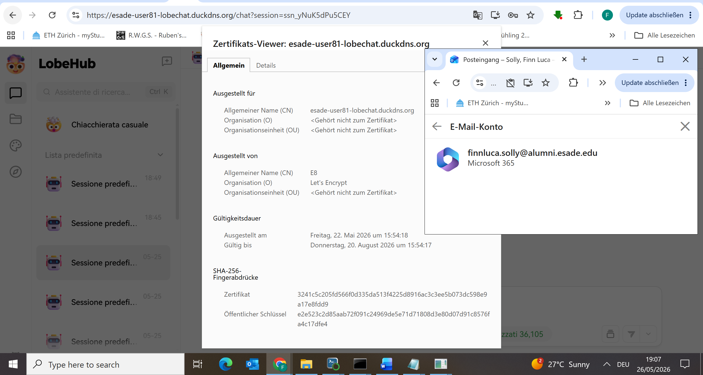
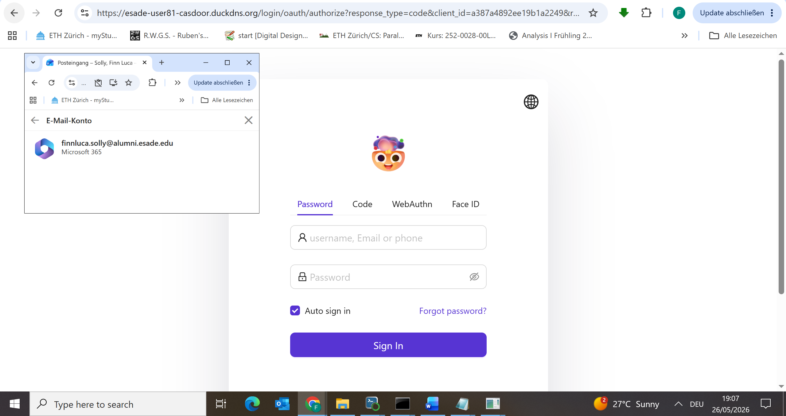
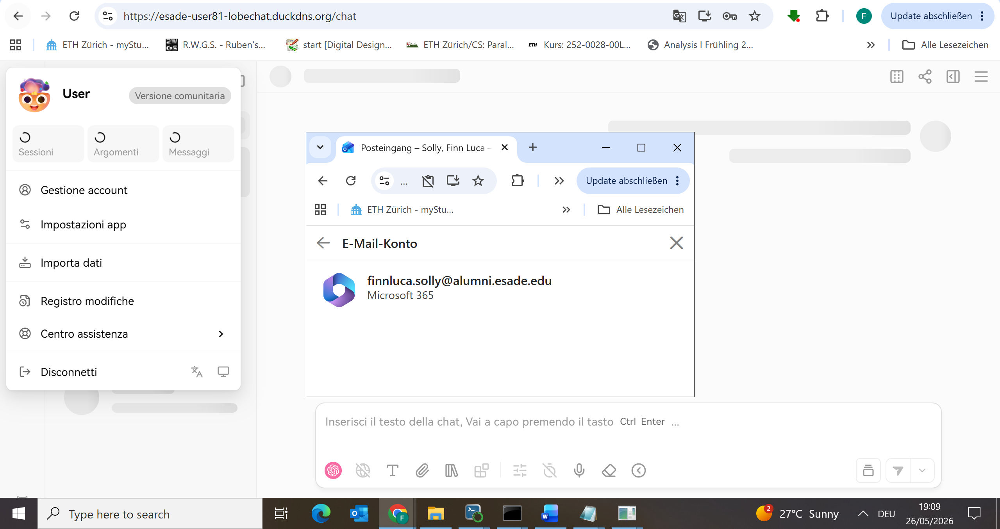
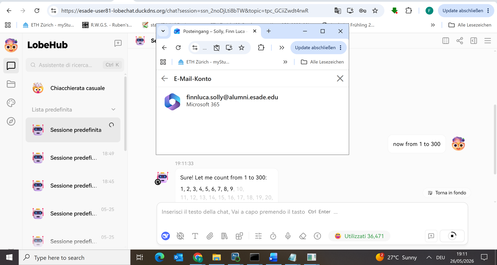
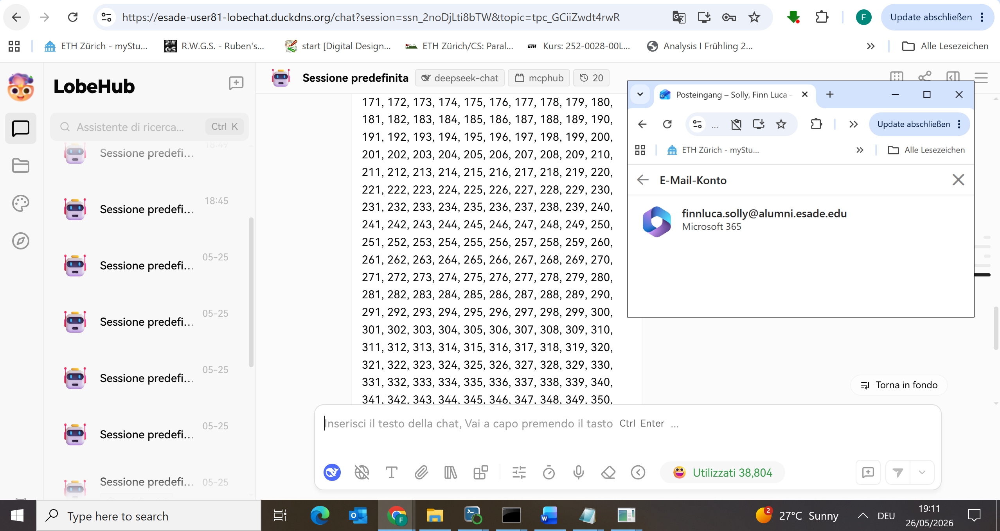
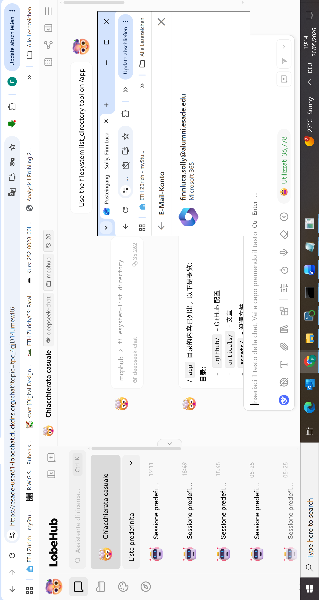
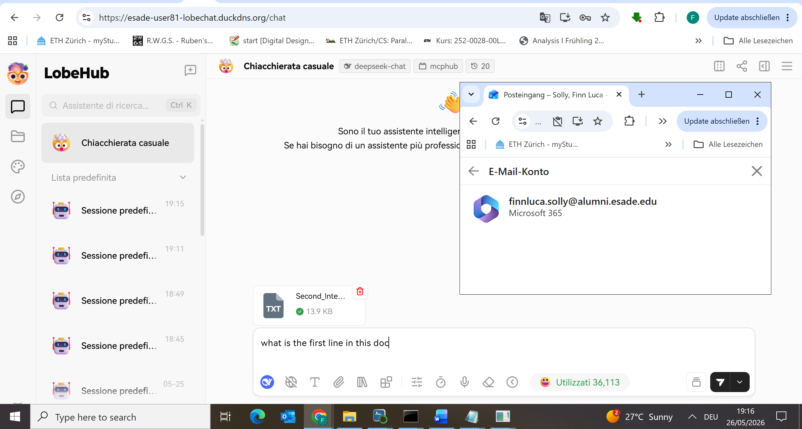
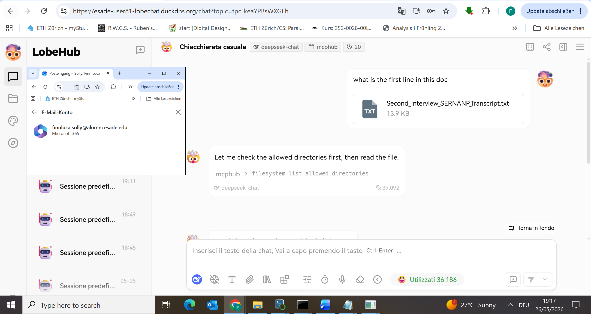
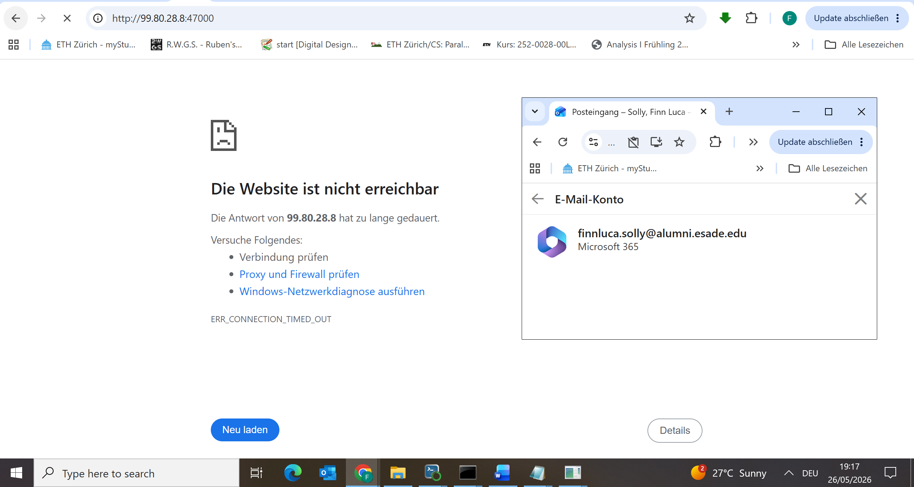

# TLS Validation Checklist

All items validated on 2026-05-26. OS clock visible in all screenshots (bottom-right corner). Screenshots in `assets/`.

---

## 1. Valid HTTPS Certificate

Browser certificate viewer for `esade-user81-lobechat.duckdns.org` shows:
- **Issued by**: Let's Encrypt (E8)
- **Valid from**: 22 May 2026
- **Valid until**: 20 August 2026
- No browser warning, full certificate chain valid

*Timestamp: 19:07, 26/05/2026*

---

## 2. Casdoor Login Flow Completes

OAuth redirect to `https://esade-user81-casdoor.duckdns.org` completes without cookie or redirect_uri errors. User lands on LobeChat chat page after successful authentication.

*Timestamp: 19:07, 26/05/2026 — OAuth redirect to esade-user81-casdoor.duckdns.org*

*Timestamp: 19:09, 26/05/2026 — Successfully logged in as "User", LobeChat chat page loaded*

---

## 3. Chat Streaming Works (SSE)

Response tokens stream incrementally through Caddy (`flush_interval -1`). Screenshots show response mid-stream with tokens appearing progressively.

*Timestamp: 19:11, 26/05/2026 — Response streaming in real-time (spinner visible, partial tokens shown)*

*Timestamp: 19:11, 26/05/2026 — Completed streaming response*

---

## 4. MCP Tool Invoked and Returned Real Results

`mcphub > filesystem-list_directory` called on `/app` and returned real directory contents from the MCPHub container. Result includes real files: `.github/`, `articals/`, `assets/`, `mcp_settings.json`, `package.json`, etc.

*Timestamp: 19:14, 26/05/2026 — filesystem-list_directory tool card showing real /app contents*

---

## 5. File Upload to MinIO Works

File uploaded via presigned PUT to `https://esade-user81-s3.duckdns.org`, served back through MinIO. Model then reads the uploaded file using the `filesystem-list_allowed_directories` and `filesystem-read_text_file` MCP tools.

*Timestamp: 19:16, 26/05/2026 — File "Second_Interview_SERNANP_Transcript.txt" (13.9 KB) successfully uploaded*

*Timestamp: 19:17, 26/05/2026 — Model using mcphub > filesystem-list_allowed_directories to read uploaded file*

---

## 6. Direct Origin Access Blocked

`http://99.80.28.8:47000` returns `ERR_CONNECTION_TIMED_OUT` — port 47000 is not open in the EC2 security group. LobeChat is only reachable via Caddy on port 443.

*Timestamp: 19:17, 26/05/2026 — ERR_CONNECTION_TIMED_OUT on direct IP:port access*
